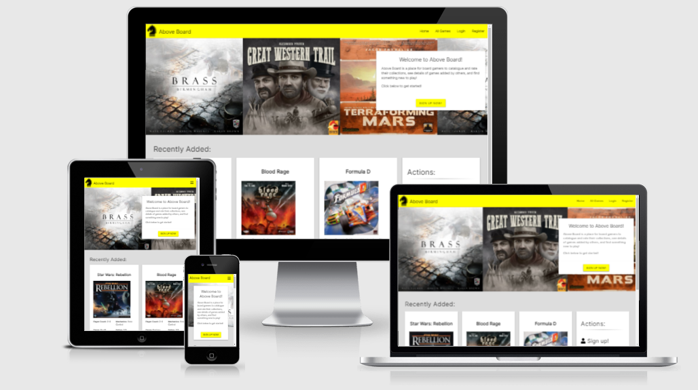
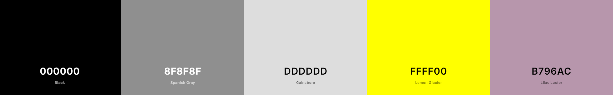
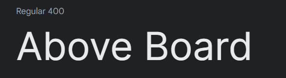

# Above Board

# Table of Contents

> 1.  [Project Goals](#project-goals)
> 2.  [UX](#ux)
> 3.  [Features](#features)
> 4.  [Technologies Used](#technologies-used)
> 5.  [Testing](#testing)
> 6.  [Bugs](#bugs)
> 7.  [Deployment](#deployment)
> 8.  [Credits](#credits)
> 9.  [Acknowledgements](#acknowledgements)

# **Project Goals**

Above Board is a place for boardgame fans to browse an extensive database of games, add and rate games, and ultimately find something fun to play. Above Board is aimed at boardgamers new and old, allowing users to log their collections, rate games and explore the database by filtering by genre and game mechanics.

**User Goals:**

- A place to log their collection, see what games other people are playing, and find something to play.

**Site Owner Goal:**

- Utilize the site's functionality themselves.
- Promote boardgaming as a hobby.
- Potentially generate income via affiliate links.

*A screenshot of the Home page as viewed on different screen sizes, generated on [ami.responsivedesign.is](http://ami.responsivedesign.is/). An interactive scrollable version is available [here](http://ami.responsivedesign.is/?url=http://above-board.herokuapp.com/home).*

# **UX**

## **User Stories**

1. As a new user, I want to be able to register an account, so I can fully utilize the site.
2. As a returning user, I want to be able to log in easily, so I can access the site’s features.
3. As a boardgame fan, I want to be able to view, search and filter a database of games, so I can find one to play.
4. As a boardgame fan, I want to add my games to the database, so I can curate my collection.
5. As a boardgame fan, I want to view my collection of games to the database, so I can see all the games I have added.
6. As a boardgame fan, I want rate games in the database, so I can provide guidance to other users.
7. As a site user, I want to be able to delete my posts, so I can remove any games I have posted.
8. As a site administrator, I want to be able to delete any user’s games, so I can remove any potentially inappropriate content.
9. As a site administrator, I want to be able to add new genres and mechanics, so I can expand the database content in line with user demands.

## **Design**

### Database Schema

Based on the above, the following schema was mapped out:

### Initial Wireframes

Based on the above, the following wireframes were mocked up:

- [Index](docs/wireframes/index.pdf)
- [Login](docs/wireframes/login.pdf)
- [Register](docs/wireframes/register.pdf)
- [Profile Page](docs/wireframes/profile.pdf)
- [All Games & My Games](docs/wireframes/all-games.pdf) 
- [Add Game & Edit Game](docs/wireframes/add-game.pdf) 
- [View Game](docs/wireframes/game-info.pdf)
- [Admin Area](docs/wireframes/admin-area.pdf)

### Colour Scheme

The color palette chosen for this project is below.

- The yellow was chosen for the navigation bar and some UI elements, as it is warm and bright and can quickly grab the users attention. Care was given to not overuse it, as it could lead to visual fatigue.
- The greys and lilac were chosen as background colors as they are muted and would not divert the users attention away from the content of the site.
- Black font is used throughout the site, to ensure readability. The contrast of the black text against the various background colors was checked with this [contrast checker](https://coolors.co/contrast-checker/000000-ffff00).

### Fonts

The fonts chosen for this project were:
1. [Scramble](https://www.fontspace.com/scramble-font-f2476)
2. [Inter](https://fonts.google.com/?query=inter)

#### Scramble

Scramble was chosen as the font for the main headers of the site. This font was chosen as visual reference to the boardgame 'Scrabble', with which many of the users of the site would already be familiar, in the hopes of eliciting a positive emotional response from them.

#### Inter

Inter is a a variable font family specifically designed to be legible on computer screens. This font was chosen to prioritize readability, particularly when database entries could have variable amounts of text.

# Features

## Features To Be Implemented

# Technologies Used

- HTML5 - the pages of this site were designed using HTML.
- CSS3 - the pages of this site were styled using CSS.
- JavaScript - the interactive elements of this site were implemented using JavaScript.
- Python - back-end functionality of the site was written in Python
- [Flask](https://flask.palletsprojects.com/en/2.0.x/#) - The Flask micro-framework - including the [Jinja](https://jinja.palletsprojects.com/) template engine and [Werkzeug](https://werkzeug.palletsprojects.com/) toolkit - was used to develop this site.
- [MongoDB](https://www.mongodb.com/) - the site's uses MongoDB as it's database platform.
- [Gitpod](https://www.gitpod.io/) - the site was developed using Gitpod as the development environment.
- [Materialize](https://materializecss.com/) - the site was styled using the Materialize front-end framework.
- [jQuery](https://jquery.com/) - jQuery was used to simplify and condense JavaScript, particularly for interacting with, and writing to, the DOM.
- [Font Awesome](https://fontawesome.com/) - Font Awesome icons were used for the social media links in the footer.
- [Google Fonts](https://fonts.google.com/) - Google Fonts were used throughout the project.
- [WebAIM Contrast Checker](https://webaim.org/resources/contrastchecker/) - Contrast Checker was used to ensure there was sufficient contrast between foreground and background colours.
- [Free Logo Design](https://www.freelogodesign.org/) - The site's brand logo was created using Free Logo Design.
- [Favicon Generator](https://www.favicongenerator.com/) - Favicon Generator was used to create and size the favicon for the site, using the logo created above.

# Testing

## Validation:

### HTML

- The HTML for the site's four pages was passed through the W3C Markup Validation Service, and no errors or warnings were found.

### CSS

- The site's CSS was passed through the W3C CSS Validation Service, and no errors were found.
- The validation tool highlighted some vendor prefixes which were added by [Autoprefixer](http://autoprefixer.github.io/) to ensure cross-browser support.

### JS

- The site's JavaScript was validated using JSHint.

### Python

## Automated Testing

## Testing of User Stories

## Manual Testing

### Testing Environments

Development and initial testing took place on a HP 250 G6 Laptop (Windows 10) in Chrome. Subsequent testing took place across the following devices, operating systems and browsers:

- Devices:

  - HP 250 G6 Laptop (Windows 10)
  - MacBook Pro 2013 (MacOS)
  - OnePlus 6T (Oxygen OS)
  - Samsung Galaxy S9 (Android)
  - Apple iPad (iPadOS 14)
- Browsers:

  - Chrome
  - Firefox
  - Edge
  - Safari

*All testing steps below were taken on all devices and browsers, unless otherwise stated.*

# Bugs

### Fixed

# Deployment

- This site was developed in [Gitpod](https://www.gitpod.io/), committed and pushed to [Github](https://github.com/), and deployed on [Heroku](https://www.heroku.com/).
- At the time of submission, there are no differences between the development version and deployed version of the site.

### The following steps were taken to deploy this site:

### To run and edit the code for this site locally, follow these steps:

# Credits

## Code

## Content

# Acknowledgements
